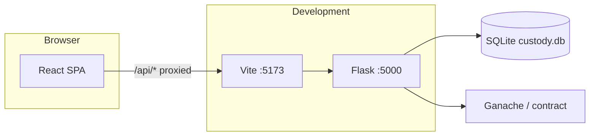

# ChainCustody — Application guide

This document explains how the **Flask backend** and **React (Vite) frontend** fit together, how to run each part, and what the system does.

---

## Architecture overview

| Layer | Technology | Role |
|--------|------------|------|
| **Backend API** | Flask (`backend/app.py`) | REST API under `/api/*`, SQLite (SQLAlchemy), session cookies, blockchain (Web3/Ganache), file uploads |
| **Frontend UI** | React + TypeScript + Vite (`web/`) | Single-page application; calls the API with `fetch(..., { credentials: 'include' })` |
| **Integration** | HTTP + cookies | In **development**, the Vite dev server proxies `/api` to Flask so the browser treats API calls as **same-origin** (session cookies work). In **production**, you can build the SPA into `web/dist` and let Flask serve it while still serving `/api/*`. |

### Data flow (simplified)



---

## Prerequisites

- **Python 3.10+** with `pip`
- **Node.js 18+** and `npm` (for the React app)
- **Ganache** on port **7545** (for blockchain features)
- Contract deployed (`deploy.py`) so `contracts/contract_abi.json` and `contracts/contract_address.txt` exist next to `ChainOfCustody.sol`

---

## Backend — how to run

From the repository root:

```bash
cd /path/to/fyp
python3 -m venv .venv
source .venv/bin/activate
python3 -m pip install -r requirements.txt
cd backend
python app.py
```

- API base URL: **http://127.0.0.1:5000**
- JSON endpoints live under **http://127.0.0.1:5000/api/...**
- First run creates SQLite `backend/custody.db` and may print **default admin** credentials (unless users already exist). Override with environment variables **`ADMIN_EMAIL`** and **`ADMIN_PASSWORD`** if desired.
- Optional: **`FLASK_SECRET_KEY`** for production session signing.

### What the backend provides

- **Authentication**: `POST /api/auth/login`, `POST /api/auth/logout`, `GET /api/auth/me`, `POST /api/auth/register` (Investigator/Member only from the public form; Admin bootstrap is separate).
- **Blockchain**: `GET /api/status`, evidence read/write through Web3 contract helpers.
- **Evidence**: list/detail, custody actions, verify upload, timeline, time-lock (admin).
- **Cases**: forensic cases, link evidence to cases, printable-style report JSON.
- **Transfers**: request/approve/reject custody transfers.
- **Alerts**: security alerts list and acknowledge.
- **Help**: topics from the `help_topics` table.
- **Admin** (role Admin): user creation, case/evidence assignment, access requests.

Passwords are stored **hashed** (Werkzeug). Role-based access is enforced server-side (`can_access_evidence`, decorators on routes).

---

## Frontend — how to run

From the repository root:

```bash
cd web
npm install
npm run dev
```

- UI: **http://127.0.0.1:5173**
- Vite is configured to **proxy** requests starting with `/api` to **http://127.0.0.1:5000**, so the React app uses relative URLs like `/api/auth/me` and session cookies stay on the dev origin.

### Production build (optional)

```bash
cd web
npm run build
```

Output: `web/dist/`. If that folder exists, `python backend/app.py` will serve `index.html` and static assets from `web/dist` for non-API routes, while `/api/*` remains the API.

---

## How they work together

1. User opens the **React** app (dev: port 5173).
2. Login form posts JSON to **`POST /api/login`** (via proxy: `/api/auth/login`).
3. Flask validates credentials, sets a **Flask session cookie** on the response.
4. Subsequent `fetch` calls include **`credentials: 'include'`** so the cookie is sent.
5. Protected API routes read `session["user"]`, `session["role"]`, etc.

**Do not** open the API on 5000 and the UI on 5173 in the browser without the proxy unless you configure CORS and cookie `SameSite`/`Secure` carefully; the provided **Vite proxy** is the intended dev setup.

---

## Frontend project structure (`web/src`)

| Path | Purpose |
|------|---------|
| `components/` | Reusable UI (e.g. layout shell, cards, buttons, route guards) |
| `pages/` | Route-level screens (dashboard, evidence, cases, admin, …) |
| `services/` | API client (`api.ts` — GET/POST helpers) |
| `hooks/` | React hooks (`useAuth` + session context) |
| `utils/` | Small helpers (formatting) |
| `styles/` | Global CSS variables and layout (soft neutral theme) |
| `assets/` | Static assets (icons/images) |

---

## Functionality summary

- **Chain of custody**: Evidence hashes and metadata on a local Ethereum chain; custody events and optional off-chain audit rows.
- **Roles**: **Admin** (full), **Investigator** (assigned cases/evidence), **Member** (assigned + request flows as implemented).
- **Integrity**: Verify uploaded file hash against on-chain record; alerts on mismatch.
- **Cases**: Group evidence IDs into forensic cases; admin assigns evidence visibility via assignments.

For API details, inspect `backend/api_routes.py` (route definitions and JSON shapes).

---

## Troubleshooting

| Issue | What to check |
|--------|----------------|
| `401` on API | Log in again; session expired or cookie not sent (`credentials: 'include'`, use dev proxy). |
| CORS errors in dev | Use **`npm run dev`** (proxy). Do not call `http://127.0.0.1:5000` directly from the React origin unless CORS is configured for it. |
| Blockchain errors | Ganache running on **7545**, contract deployed, ABI/address files present. |
| Empty evidence list (Investigator/Member) | Admin must **assign** evidence IDs to the user under **Admin → Assign**. |

---

## Author

FYP — M. Talha · fa-2022/BS/DFCS/075
